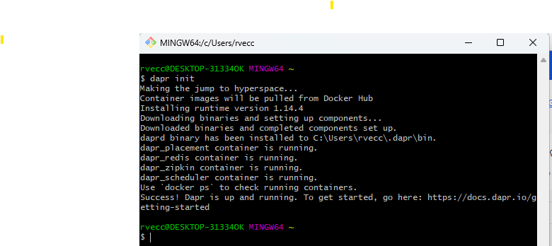
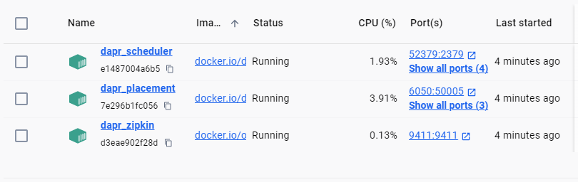

# Environment Setup Guide

## Table of Contents
- [Repository Overview](#repository-overview)
- [Environment Setup](#environment-setup)
- [Application Deployment](#application-deployment)
  - [Pipeline and Tenant Setup](#pipeline-and-tenant-setup)
  - [Cypress Setup](#cypress-setup)

## Repository Overview
Repository for all artifacts, solutions and projects for the cocktails website.

## Environment Setup

### Required Software
1. **Visual Studio**
2. **Cursor or VS Code**
3. **Chocolatey**
   - Install from [chocolatey.org](https://chocolatey.org/install)

### Development Tools

#### Terraform
```bash
choco install terraform
```

#### Git Configuration
```bash
# Set Git configuration
git config --global core.autocrlf true
git config --global user.name "John Doe"
git config --global user.email "johndoe@mailinator.com"
```

#### Node Version Manager (nvm)
1. Install nvm from [nvm-sh/nvm](https://github.com/nvm-sh/nvm#install--update-script)
2. Create `.bash_profile` in home directory (`C:\Users\YourUserName`)
3. Run in Git Bash:
   ```bash
   curl -o- https://raw.githubusercontent.com/nvm-sh/nvm/v0.39.4/install.sh | bash
   ```
4. Add to environment variables if needed: `C:\Program Files\Git\bin`
5. Configure nvm:
   ```bash
   export NVM_DIR="$HOME/.nvm"
   [ -s "$NVM_DIR/nvm.sh" ] && \. "$NVM_DIR/nvm.sh"
   [ -s "$NVM_DIR/bash_completion.sh" ] && \. "$NVM_DIR/bash_completion.sh"
   ```
6. Verify installation:
   ```bash
   nvm -v
   nvm install node
   node -v
   ```

#### Docker Setup
1. **Enable Virtualization**
   - Check Task Manager > Performance tab > Virtualization: Enabled

2. **Install WSL**
   ```powershell
   # Run in PowerShell as Administrator
   wsl --install
   ```
   - Enable Windows Features:
     - Virtual Machine Platform
     - Windows Hypervisor Platform
     - Windows Subsystem for Linux
   ```powershell
   dism.exe /online /enable-feature /featurename:Microsoft-Windows-Subsystem-Linux /all /norestart
   ```
   - Download and install [Linux Kernel Update Package](https://learn.microsoft.com/en-us/windows/wsl/install-manual#step-4--download-the-linux-kernel-update-package)
   ```powershell
   wsl --set-default-version 2
   ```

3. **Install Docker Desktop**
   - Download from [Docker Desktop for Windows](https://docs.docker.com/desktop/install/windows-install/)
   - Add user to docker-users group (if needed):
   ```powershell
   net localgroup docker-users "domain\YourUserName" /ADD
   ```

4. **NPM Authentication**
   ```bash
   npm install -g vsts-npm-auth
   vsts-npm-auth -config .npmrc
   ```

5. **Install Yarn**
   ```bash
   npm install -g yarn
   ```

#### Azure Tools
1. **Azure CLI**
   - Install from [Microsoft Docs](https://learn.microsoft.com/en-us/cli/azure/install-azure-cli-windows?tabs=azure-cli)
   - Or via PowerShell:
   ```powershell
   $ProgressPreference = 'SilentlyContinue'
   Invoke-WebRequest -Uri https://aka.ms/installazurecliwindows -OutFile .\AzureCLI.msi
   Start-Process msiexec.exe -Wait -ArgumentList '/I AzureCLI.msi /quiet'
   Remove-Item .\AzureCLI.msi
   ```

2. **Azure Functions Core Tools**
   ```bash
   choco install azure-functions-core-tools -y
   ```
   - Update in Visual Studio: Tools > Options > Projects and Solutions > Azure Functions

3. **Azurite (Azure Storage Emulator)**
   - Pull and run the Azurite Docker image:
   ```bash
   docker pull mcr.microsoft.com/azure-storage/azurite
   docker run --restart=always -d --name azurite-cocktails -p 10000:10000 -v <absolute-path-to-repo-code>.azurite:/workspace mcr.microsoft.com/azure-storage/azurite azurite-blob --blobHost 0.0.0.0
   ```
   - For detailed configuration and troubleshooting, see the [Azurite Setup Guide](./readme-azurite.md)

3. **Cosmos Db (Emulator)**
   - Pull and run the Cosmos Emulator (for Linux) Docker image:
   ```bash
   docker pull mcr.microsoft.com/cosmosdb/linux/azure-cosmos-emulator:vnext-preview
   docker run --restart=always -d --name cosmos-cocktails -p 8081:8081 -p 1234:1234 mcr.microsoft.com/cosmosdb/linux/azure-cosmos-emulator:vnext-preview --protocol https

   docker ps
   ```
   - For detailed configuration and troubleshooting, see the [Cosmos Emulator Setup Guide](./readme-cosmos.md)


### Visual Studio Integration

#### Git Bash in Visual Studio
1. **Terminal Integration**
   - Tools > Options > Environment > Terminal
   - Add Git Bash path to `sh.exe`
   

2. **External Tools**
   - Tools > External Tools
   - Add Git Bash path to `git-bash.exe`
   

### Dapr Installation
1. Download latest MSI from [Dapr CLI Releases](https://github.com/dapr/cli/releases)
2. Start Docker Desktop
3. Initialize Dapr:
   ```bash
   dapr init
   ```
   
4. Verify installation:
   ```bash
   dapr --version
   docker ps
   ```
   

## Application Deployment

### Pipeline and Tenant Setup

#### ADO Terraform Project
- Manages resource groups and service principals
- Run build pipeline for resource group setup

#### B2C Tenant Setup
- Follow [B2C Setup Guide](./Readme-b2c.md)

#### Infrastructure Setup
1. **Shared Infrastructure**
   - Run pipeline for shared resources
   - Creates DNS Zone for cezzis.com

2. **Cocktails.SharedInfrastructure**
   - Sets up environment keyvaults
   - Configures subnet access
   - Establishes container registry password

3. **Cocktails.Api**
   - Verify terraform environment variables
   - Creates API and app registration
   - Manual steps:
     - Update Google reCAPTCHA site secret
     - Configure pipeline warmup stage
     - Grant Admin Consent in B2C tenant
     - Note API app registration client_id and scopes

4. **Cocktails.Frontend**
   - Verify terraform environment variables
   - Manual steps:
     - Update Google reCAPTCHA site key
     - Configure Zoho email app password
     - Create container app custom domain bindings
     - Grant Admin Consent in B2C tenant
     - Update pipeline with app registration client_id

5. **Cocktails.Images**
   - Verify terraform environment variables
   - Configure allowed origins if needed

### Cypress Setup

1. **Create Test Account**
   - Register new account on website
   - Note username and password

2. **Configure Keyvault**
   - Update `e2e-cypress-user-password` secret

3. **Update Pipeline Configuration**
   ```yaml
   - template: ui-cypress.yml
     parameters:
       baseUrl: 'https://www.cezzis.com'
       b2cUrl: 'https://login.cezzis.com/'
       b2cTenantId: 'fb512a9c-5b44-41ab-8042-6465769f16c9'
       b2cClientId: '84744194-da27-410f-ae0e-74f5589d4c96'
       b2cUserObjectId: '41598664-1466-4e3e-b28c-dfe9837e462e'
       b2cUserEmail: 'rvecchi+cypress@gmail.com'
       b2cUserPassword: '$(e2e-cypress-user-password)'
   ```

> **Note**: 
> - Get user object_id from Azure tenant
> - Use frontend app registration client_id
> - Pipeline should now run successfully with Cypress tests